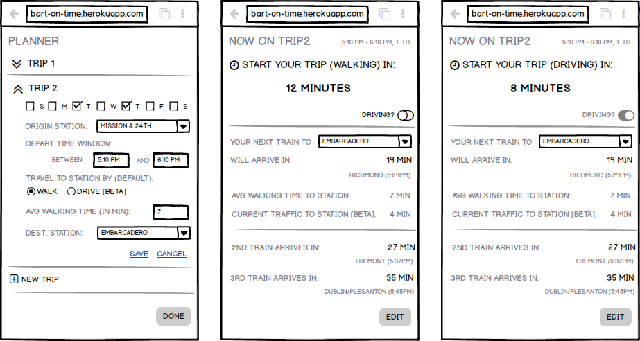

#### Project Title
- Bart Timer

#### Team Members
- David Rivera
- Juan C. Reyes
- Meggin Kearney
- Tae Lim

#### Project Description
- User Input:
    - Origin/Destiation Station Names
    - Departure Time Window
    - DoW (Day of Week)
    - Estimated walking time to origin station
- Output
    - Next train arrival times (up to 3 trains total)
    - Time to leave to arrive on time
- Extra features (time allowing)
	- Walk or Drive as a default setting
	- If driving is selected, live traffic time to the origin station from Google Maps API
	- (One major caveat for driving is that the traffic time buffer does not factor in the travelling time incurred getting to/from the user's car)

#### Sketch of Final Product 

#### API to be Used 
- Bart
	- Example: http://api.bart.gov/api/etd.aspx?cmd=etd&orig=RICH&key=MW9S-E7SL-26DU-VV8V
- Google Maps
- Firebase

####  Rough Breakdown of Tasks
- Take in user inputs
- Store user inputs and generate URL
- Load BART API data based on user input 
- Display on the generated URL
- Parse XML to JSON

#### Other Useful Resources
- https://www.getpostman.com/
- http://www.utilities-online.info/xmltojson/
